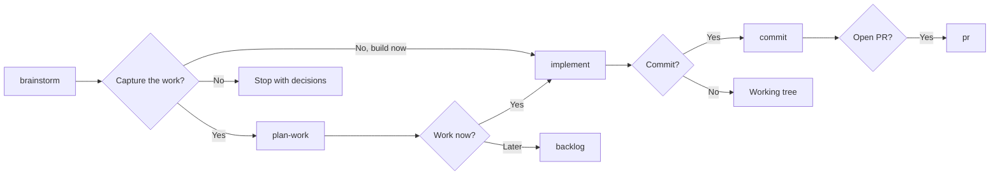
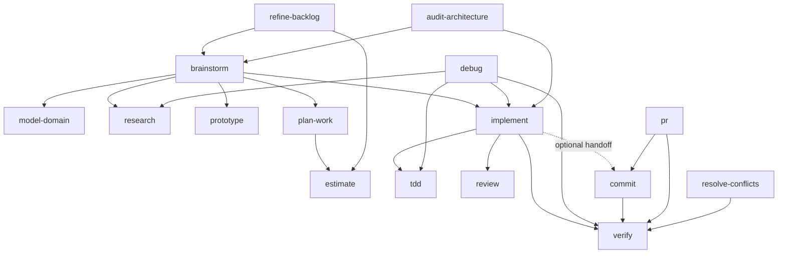

# Propulsion Skills Plan

## Purpose

This document defines the intended Propulsion engineering workflow and the high-level contract for each skill. It is the shared brief for the agents that will design and implement the individual skill bundles.

It deliberately stops short of specifying complete prompts, schemas, templates, scripts, or edge-case behaviour. Each skill must still go through the `write-skill` use-case modelling, design, writing, and validation workflow before implementation.

## Outcome

Propulsion will be a small suite of predictable, independently useful engineering skills for an individual developer directing a coding agent. The suite should support a natural path from an uncertain idea to verified code and optional Git delivery without making that path mandatory.

The primary flow is:



Every node remains directly invocable. A developer may start with `implement`, `debug`, `review`, `commit`, or any other suitable skill without first traversing the primary flow.

## Governing principles

### Predictable process, adaptable outcome

A skill makes the agent's process predictable without predetermining the result. Fragile operations receive narrow degrees of freedom; judgement-heavy work receives explicit decision boundaries.

### Composition without coupling

- Every skill must be useful when invoked alone.
- Orchestrating skills may invoke supporting skills, but the full workflow is never a prerequisite.
- Handoffs are optional routes offered after the current skill has satisfied its own postconditions.
- User intent determines whether the workflow continues to tickets, implementation, commits, or a pull request.

### Cohesive boundaries

Prefer the smallest cohesive suite, not the largest number of reusable fragments. Extract a responsibility only when it is independently useful, reused by multiple workflows, requires a distinct invocation policy, or is fragile enough to need its own guardrails.

Repository exploration, project creation, ticket creation, and refactoring do not currently justify separate skills. They remain steps or branches inside the skills that own their outcomes.

### Methodology, not cargo cult

Each skill must choose one dominant established method that governs its process. Add another only when it governs a distinct concern. Use recognised terminology as a leading word and explain only the Propulsion-specific adaptation or constraint.

Repository evidence and explicit user intent outrank generic advice. Sources such as _Clean Code_ are inputs rather than unquestionable law; future skill authors must resolve tensions using the concrete problem, project conventions, and the best-fitting engineering principle.

### Durable context

Facts discoverable in the repository are looked up rather than asked of the user. Decisions belong to the user. Durable conclusions live in the narrowest appropriate source: code, tests, `CONTEXT.md`, ADRs, project records, tickets, commits, or review documents.

### Evidence before completion

Implementation is complete when observable behaviour is implemented, executable verification passes, and no material review findings remain. Commit and pull-request state are separate, optional delivery concerns.

## Repository contracts

### Domain documentation

- A root `CONTEXT.md` is the canonical project glossary.
- ADRs live under `docs/adr/`.
- `CONTEXT.md` contains domain language only, never implementation decisions or specifications.
- ADRs are created sparingly for decisions that are hard to reverse, surprising without context, and the result of a real trade-off.

### Local ticket tracker

Propulsion uses a fixed, repository-native Markdown tracker. External tracker adapters and setup workflows are outside the current scope.

```text
docs/tickets/
├── projects/
├── backlog/
├── ready/
├── in-progress/
├── blocked/
├── done/
└── cancelled/
```

Directories are created lazily. A ticket's directory is the sole source of truth for its status; status must not be duplicated in frontmatter.

```mermaid
stateDiagram-v2
    [*] --> backlog: postpone
    [*] --> ready: select now
    backlog --> ready: select for execution
    ready --> in-progress: begin implementation
    in-progress --> done: implementation verified
    in-progress --> blocked: unexpected impediment
    blocked --> ready: impediment resolved
    backlog --> cancelled
    ready --> cancelled
    blocked --> cancelled
```

#### Status semantics

- `backlog` contains fully specified, actionable work that has been deliberately postponed.
- `ready` contains fully specified, actionable work selected for execution with completed planned dependencies.
- `in-progress` contains work currently being implemented.
- `blocked` is reserved for an unexpected impediment encountered after selection or commencement. Planned dependency ordering does not make a ticket blocked.
- `done` means implementation, executable verification, and material review findings are complete. It does not mean committed, pushed, merged, or released.
- `cancelled` preserves deliberately abandoned work and its history.

Outstanding decisions must be resolved by `brainstorm`, `research`, or `prototype` before a ticket is created. The tracker does not contain draft or incomplete tickets.

#### Projects and ticket identity

Every ticket belongs to exactly one documented project. Project records use `{PROJECT-KEY}.md`, such as `docs/tickets/projects/CACHE.md`, and hold the shared outcome, scope, constraints, success measures, and durable references that should not be repeated in each ticket.

Ticket filenames use:

```text
{PROJECT-KEY}-{SEQUENCE}-{SLUG}.md
```

For example, `CACHE-001-add-redis-driver.md` has the stable ticket ID `CACHE-001`. The project-local sequence is allocated by scanning every status directory. References use the stable ID; the descriptive slug may change when the title improves.

Ticket frontmatter should carry descriptive and planning metadata such as the stable ID, project key, title, priority, estimate, confidence, labels, dependencies, and relevant dates. The exact schema belongs to the `plan-work` design. Ticket bodies must give an implementation agent sufficient context, intended outcome, constraints, acceptance criteria, and validation expectations without prescribing stale file-level implementation details.

#### Estimation

Ticket estimates use the Fibonacci scale `1, 2, 3, 5, 8`. Estimates are evidence-based relative sizes, not hours, deadlines, or padded commitments. Complexity, uncertainty, dependencies, integration risk, testing scope, and confidence remain visible rather than being hidden inside a larger number.

Work above 5 points should be considered for decomposition into independently verifiable vertical slices. An 8 is allowed when the work is genuinely broad or uncertain, but should trigger scrutiny rather than becoming a convenient bucket.

## Skill catalogue

| Skill                | Invocation | Responsibility                                                                                       | Primary compositions                                                             |
| -------------------- | ---------- | ---------------------------------------------------------------------------------------------------- | -------------------------------------------------------------------------------- |
| `brainstorm`         | User       | Resolve an idea or decision tree through a relentless one-question-at-a-time interview               | `model-domain`, `research`, `prototype`; hands off to `plan-work` or `implement` |
| `model-domain`       | Model      | Maintain ubiquitous language and qualifying architectural decisions                                  | Used by `brainstorm` and any skill that changes the domain model                 |
| `research`           | Model      | Answer an external technical question from high-trust primary sources and record cited findings      | Feeds `brainstorm`, `debug`, or `implement`                                      |
| `prototype`          | Model      | Build the smallest disposable experiment that answers one design question                            | Feeds conclusions back to `brainstorm` or `implement`                            |
| `plan-work`          | User       | Create or update a project and produce one or more fully resolved tickets                            | Uses `estimate`; hands off to `implement` or the backlog                         |
| `refine-backlog`     | User       | Keep actionable postponed work current, ordered, and deliberately promoted                           | Uses `estimate`; may hand stale decisions to `brainstorm`                        |
| `estimate`           | Model      | Size work using evidence-calibrated Fibonacci estimates                                              | Used by `plan-work` and `refine-backlog`                                         |
| `implement`          | User       | Implement one coherent unit of work from a ticket, conversation, or direct request                   | Uses `tdd`, `review`, and `verify`; offers `commit`                              |
| `tdd`                | Model      | Develop observable behaviour through test-driven vertical slices                                     | Used by `implement` and fix-authorised `debug`                                   |
| `review`             | Model      | Read a diff against intent and engineering quality, producing prioritised findings                   | Used by `implement`; may feed findings back to `implement`                       |
| `verify`             | Model      | Discover and run relevant executable repository checks and report evidence                           | Used by `implement`, `debug`, `commit`, `pr`, and `resolve-conflicts`            |
| `commit`             | User       | Turn the intended working-tree scope into coherent atomic commits                                    | May use `verify`; may be invoked by `pr` for PR preparation                      |
| `pr`                 | User       | Prepare, push, and open a pull request with release metadata and evidence                            | Uses `commit` and `verify`                                                       |
| `debug`              | Model      | Diagnose hard bugs scientifically and optionally carry an authorised fix through regression coverage | May use `research`, `tdd`, `implement`, and `verify`                             |
| `audit-architecture` | User       | Find structural improvement opportunities and communicate them visually and durably                  | May hand a selected opportunity to `brainstorm` or `implement`                   |
| `resolve-conflicts`  | Model      | Resolve an active merge or rebase by recovering and preserving both intents                          | Uses tickets, history, and `verify`                                              |
| `write-skill`        | User       | Create or update a skill through use-case modelling and lossless compression                         | Governs implementation of every skill in this plan                               |

## Skill briefs

### `brainstorm`

- **Job:** Sharpen a request, plan, or design by walking its decision tree one question at a time. Every question includes a recommended answer.
- **Inputs:** A user idea plus repository facts discovered by reading the codebase and existing durable documentation.
- **Outputs:** Shared understanding, updated domain language or qualifying ADRs, and an optional handoff to `plan-work`, direct `implement`, or no further action.
- **Boundaries:** It does not create tickets or implement work. It does not ask the user for facts the repository can supply. It must resolve outstanding decisions before offering ticket creation.
- **Methodology:** Socratic questioning, decision trees, concrete scenarios, Evans's ubiquitous language, and Nygard-style ADRs.
- **Design work remaining:** Define completion signals, research/prototype detours, how the interview resumes, and the exact handoff wording.

### `model-domain`

- **Job:** Actively sharpen project terminology and record qualifying decisions as the model changes.
- **Inputs:** Existing `CONTEXT.md`, ADRs, code evidence, and a live design discussion.
- **Outputs:** Precise glossary updates and sparse ADRs.
- **Boundaries:** Reading established vocabulary is a normal habit, not a reason to invoke this skill. `CONTEXT.md` remains a glossary rather than a specification or implementation log.
- **Methodology:** Domain-Driven Design, ubiquitous language, bounded contexts when genuinely needed, concrete scenario testing, and lightweight ADRs.
- **Design work remaining:** Adapt the existing format resources to the final skill name and validate single- versus multi-context routing without adding speculative structure.

### `research`

- **Job:** Investigate one bounded external question against high-trust primary sources.
- **Inputs:** A precise research question and its relevance to the current engineering decision.
- **Outputs:** A concise, cited Markdown finding that separates evidence, inference, uncertainty, and recommendation.
- **Boundaries:** Research informs a decision; it does not make product decisions or silently implement conclusions.
- **Methodology:** Evidence hierarchy, primary-source research, falsification, and reproducible citations.
- **Design work remaining:** Decide artifact location, source-quality rules, freshness handling, and when ephemeral findings do not warrant a file.

### `prototype`

- **Job:** Create the smallest disposable program or interface variation needed to answer one explicit design question.
- **Inputs:** A question that cannot be settled confidently through conversation, code reading, or documentary research.
- **Outputs:** Runnable evidence and a recorded conclusion that can return to `brainstorm` or implementation planning.
- **Boundaries:** Prototype code is throwaway and is not production implementation. The answer survives; accidental architecture does not.
- **Methodology:** Brooks's “plan to throw one away”, technical spikes, evolutionary learning, and rapid feedback.
- **Design work remaining:** Define logic/UI branches, lifecycle and disposal rules, and how validated conclusions are retained without normalising prototype code.

### `plan-work`

- **Job:** Turn a resolved conversation or coherent request into a documented project and one or more implementation-ready tickets.
- **Inputs:** Completed decisions, relevant domain documents, repository evidence, and the user's desired timing.
- **Outputs:** A project record plus tickets placed in `backlog` when postponed or `ready` when selected for immediate execution.
- **Boundaries:** It creates no incomplete tickets and does not reopen product discovery. Ambiguity routes back to `brainstorm`. Project and ticket creation are branches of this skill, not separate skills.
- **Methodology:** Pragmatic Programmer tracer bullets, vertical slicing, INVEST-style work-item quality, dependency graphs, and YAGNI.
- **Design work remaining:** Define project and ticket schemas, ticket-ID allocation, duplicate/concurrency handling, dependency representation, and one-ticket versus multi-ticket approval flows.

### `refine-backlog`

- **Job:** Keep fully specified postponed work useful and decide which work should become active.
- **Inputs:** Project summaries and backlog ticket metadata, loading full ticket bodies only when required.
- **Outputs:** Updated priority, estimate, dependency, or cancellation decisions and deliberate moves into `ready`.
- **Boundaries:** It does not finish incomplete requirements. Stale or newly ambiguous work routes to `brainstorm` before remaining actionable.
- **Methodology:** Backlog refinement, cost of delay, dependency ordering, WIP discipline, and evidence-based prioritisation.
- **Design work remaining:** Define prioritisation vocabulary, stale-ticket detection, project filtering, and the level of user confirmation required for transitions.

### `estimate`

- **Job:** Break down and size engineering work using the developer's existing Fibonacci practice.
- **Inputs:** A single proposed ticket or a larger outcome that may need multiple tickets.
- **Outputs:** `1`, `2`, `3`, `5`, or `8` with confidence, assumptions, dependencies, risks, and concise evidence.
- **Boundaries:** It does not pad for safety or turn points into time commitments. It proposes a split when independent outcomes make that more honest.
- **Methodology:** Fibonacci relative sizing, Planning Poker calibration, disprove-first critique, vertical slicing, and the uncertainty lessons of _The Mythical Man-Month_.
- **Design work remaining:** Adapt the current OpenCode estimator's critique loop, matrices, and single/multi-ticket output branches into a self-contained skill.

### `implement`

- **Job:** Implement one coherent unit of work from a ticket, the resolved current conversation, or a direct request.
- **Inputs:** An actionable ticket or sufficiently clear user instruction. Ticket creation is optional.
- **Outputs:** Working code or documentation, appropriate tests, passing verification, no unresolved material review findings, and a completed ticket transition when applicable.
- **Boundaries:** It does not commit or open a PR. It does not force TDD onto non-behavioural documentation, metadata-only work, or disposable prototypes.
- **Methodology:** TDD by default for observable behaviour, tracer-bullet vertical slices, YAGNI, DRY, Code Complete construction discipline, and iterative review.
- **Composition:** For behaviour changes, use `tdd`; then run `review`, implement material findings, and repeat until the material-finding gate is clear; run `verify`; offer `commit` at handoff.
- **Ticket behaviour:** Move `ready` to `in-progress` on commencement and to `done` when implementation, verification, and material review findings are complete. With no ticket, do not create one implicitly.
- **Design work remaining:** Define material-finding severity, loop termination, safe handling of direct requests, ticket failure transitions, and TDD exceptions.

### `tdd`

- **Job:** Develop behaviour in small red–green–refactor cycles, one vertical slice at a time.
- **Inputs:** An observable behaviour and a meaningful public seam.
- **Outputs:** Behavioural tests that fail for the intended reason, minimal passing implementation, and local design improvement while green.
- **Boundaries:** Tests describe behaviour rather than implementation. Avoid speculative horizontal test batches, tautological assertions, and mock-heavy tests of internals.
- **Methodology:** Beck's test-driven development, Feathers's seams and characterization tests, tracer bullets, and outside-in behavioural testing.
- **Design work remaining:** Define seam selection, mocking guidance, legacy-code branches, integration-test policy, and the relationship between local refactoring and the wider `review` loop.

### `review`

- **Job:** Assess a diff from a pinned fixed point and report evidence-backed findings without modifying code.
- **Inputs:** A diff, its originating intent or ticket, and repository standards.
- **Outputs:** Prioritised findings across two independent axes: intent fidelity and engineering quality.
- **Boundaries:** It remains read-only. Refactoring opportunities are findings implemented later through `implement`; there is no separate `refactor` skill.
- **Methodology:** Fagan inspection, Fowler code smells and refactoring vocabulary, Clean Code and Code Complete practices where applicable, security/performance risk analysis, and spec conformance.
- **Design work remaining:** Define severity and materiality, fixed-point discovery, evidence requirements, false-positive handling, and whether independent axes benefit from separate agents.

### `verify`

- **Job:** Produce executable evidence that the relevant repository expectations pass.
- **Inputs:** The changed scope and repository-provided instructions, scripts, CI configuration, and test layout.
- **Outputs:** Commands run, pass/fail evidence, relevant omissions, and a clear verification conclusion.
- **Boundaries:** It does not reason about intent or maintainability like `review`, and it does not fix failures unless the calling request also authorises implementation.
- **Methodology:** Fast feedback loops, continuous integration, test pyramids or test portfolios appropriate to the repository, and fail-fast ordering.
- **Design work remaining:** Define command discovery, targeted versus full checks, smoke-test selection, stale evidence, and failure routing.

### `commit`

- **Job:** Convert the intended working-tree scope into one or more coherent atomic commits.
- **Inputs:** The complete diff, repository instructions, relevant ticket/project context, and current verification evidence.
- **Outputs:** Intentional commits with Conventional Commit subjects and useful explanatory bodies when needed.
- **Boundaries:** It preserves unrelated user changes, does not open a PR, and does not treat “commit everything” as permission to combine unrelated concerns.
- **Methodology:** Atomic commits, cohesive change sets, Conventional Commits, and narrative source history.
- **Design work remaining:** Define staging and grouping, user confirmation, verification freshness, amend behaviour, ticket references, and handling of mixed or dirty worktrees.

### `pr`

- **Job:** Prepare, push, and open a pull request for committed work.
- **Inputs:** The branch history, target branch, project/ticket context, review findings, and verification evidence.
- **Outputs:** A pushed branch and PR whose Conventional Commit title and body communicate intent, important decisions, validation, and related tickets.
- **Boundaries:** It is explicitly user-invoked. It does not conceal failing checks or unresolved material findings.
- **Repository rule:** Determine the appropriate semantic-version change, synchronize mirrored manifest versions, and use `commit` when PR preparation changes files.
- **Methodology:** Semantic Versioning, Conventional Commits, small reviewable changes, and evidence-rich change descriptions.
- **Design work remaining:** Define version inference, base-branch selection, PR templates, draft policy, push safety, and provider-specific tooling.

### `debug`

- **Job:** Diagnose a hard bug or performance regression scientifically and continue to a fix only when authorised.
- **Inputs:** A failure report, observed evidence, and the affected environment.
- **Outputs:** A tight feedback loop, minimized reproduction, ranked and falsified hypotheses, root cause, and either a diagnosis or a regression-covered fix.
- **Boundaries:** Diagnosis-only requests stop before code modification. A fix request may compose `tdd`, `implement`, and `verify`.
- **Methodology:** Scientific method, Zeller-style delta debugging, binary search, instrumentation, hypothesis logs, and regression testing.
- **Design work remaining:** Define deterministic and intermittent branches, feedback-loop thresholds, hypothesis-log persistence, performance diagnosis, and no-reproduction outcomes.

### `audit-architecture`

- **Job:** Find structural improvements that make a codebase easier for humans and agents to understand, change, and verify.
- **Inputs:** Repository structure, domain boundaries, dependency relationships, tests, change patterns, and project instructions.
- **Outputs:** A throwaway interactive HTML report for exploration and a durable Markdown architecture review for history.
- **Boundaries:** It remains read-only. A selected opportunity hands off to `brainstorm` when decisions remain or directly to `implement` when the change is already clear.
- **Methodology:** Parnas information hiding, Ousterhout deep modules, Fowler refactoring, Evans bounded contexts, Brooks conceptual integrity, coupling/cohesion, and change amplification.
- **Design work remaining:** Define analysis dimensions, candidate ranking, HTML lifecycle and interaction model, durable report location, and agent-navigability criteria.

### `resolve-conflicts`

- **Job:** Complete an active merge or rebase conflict while preserving the intent behind both sides.
- **Inputs:** Conflict state, commits, tickets, PR context, surrounding history, and repository checks.
- **Outputs:** Resolved hunks, completed merge/rebase state, and passing relevant verification.
- **Boundaries:** It does not invent unrelated behaviour or use destructive history operations as shortcuts.
- **Methodology:** Three-way merge reasoning, primary-source intent recovery, semantic conflict resolution, and post-merge verification.
- **Design work remaining:** Define merge versus rebase branches, conflict-source discovery, incompatible-intent escalation, staging/continuation mechanics, and repeated-conflict handling.

### `write-skill`

`write-skill` already exists and is the required authoring workflow for every skill above. Its naming, invocation, structure, resource, dry-run, DRY, YAGNI, and lossless-compression rules govern the implementation work.

## Dependency map



Arrows show available composition, not mandatory global sequencing.

## Methodology map

| Capability      | Dominant methods and source traditions                                                                                             |
| --------------- | ---------------------------------------------------------------------------------------------------------------------------------- |
| Discovery       | Socratic questioning, decision trees, concrete scenarios, evidence gathering                                                       |
| Domain language | Eric Evans's Domain-Driven Design and ubiquitous language; Michael Nygard's ADR practice                                           |
| Work slicing    | _The Pragmatic Programmer_ tracer bullets, vertical slices, INVEST, dependency graphs, YAGNI                                       |
| Estimation      | Fibonacci relative sizing, Planning Poker, critique-driven calibration, Brooks on uncertainty and scheduling                       |
| Implementation  | Kent Beck's TDD, tracer bullets, DRY/YAGNI, Steve McConnell's construction discipline                                              |
| Legacy code     | Michael Feathers's seams and characterization tests                                                                                |
| Review          | Fagan inspections, Martin Fowler's code smells/refactoring, _Clean Code_, _Code Complete_, repository standards                    |
| Algorithms      | Knuth's emphasis on precise specification, correctness, data structures, and complexity analysis when algorithmic work warrants it |
| Architecture    | Parnas information hiding, Ousterhout deep modules, Evans bounded contexts, Brooks conceptual integrity, coupling/cohesion         |
| Debugging       | Scientific method, delta debugging, binary search, instrumentation, regression tests                                               |
| Delivery        | Atomic commits, Conventional Commits, Semantic Versioning, small reviewable changes, continuous integration                        |
| Prototyping     | Brooks's “plan to throw one away” and time-boxed technical spikes                                                                  |

These are vocabulary and reasoning tools, not a requirement to cite every source in every skill or reproduce generic book summaries inside skill bundles.

## Suggested implementation order

The order below reduces rework by implementing shared supporting capabilities before their orchestrators. It is a recommendation, not a workflow restriction.

1. **Foundations:** `model-domain`, `estimate`, `tdd`, `review`, `verify`.
2. **Primary flow:** `brainstorm`, `plan-work`, `implement`.
3. **Planning and delivery:** `refine-backlog`, `commit`, `pr`.
4. **Discovery and recovery:** `research`, `prototype`, `debug`, `audit-architecture`, `resolve-conflicts`.

An agent may work on one skill at a time, but it must read the high-level contracts of direct callers and callees before fixing the boundary.

## Instructions for skill implementation agents

For each skill:

1. Read this plan, the complete `write-skill` bundle, relevant repository instructions, existing domain language, and the briefs for direct callers and callees.
2. Study the corresponding Matt Pocock engineering skill where one exists, plus other acknowledged prior art. Preserve useful techniques, not wording or accidental structure.
3. Run the `write-skill` create branch. Model concrete user prompts, expected behaviour, inputs, outputs, invocation conditions, failure branches, composition points, and constraints before writing files.
4. Select one dominant established method. Verify source terminology where precision matters and state only the Propulsion-specific adaptation.
5. Use the agreed name unless use-case modelling proves it misleading. Any rename must be checked against the full catalogue and `write-skill` naming rules.
6. Apply the invocation policy in this plan and keep frontmatter plus `agents/openai.yaml` synchronized.
7. Keep the bundle self-contained. Add a reference, script, or asset only for a concrete branch; apply the Rule of Three unless a fragile first-use operation needs deterministic automation.
8. Keep common requirements inline and branch-specific detail one link away. Avoid duplicated definitions across skills; the owner named in this plan is the source of truth.
9. Preserve independent invocation. Callers may compose the skill, but the skill must not assume the caller or demand completion of later workflow stages.
10. Dry-run every use case and handoff. Exercise scripts, validate resource links and invocation metadata, then apply lossless compression without removing behaviour.
11. Run `bun run checks` after implementation. When raising a PR, update the semantic version in `package.json` and keep mirrored manifest versions synchronized.
12. Update this plan only when implementation changes a high-level boundary, name, dependency, or governing contract. Low-level implementation detail belongs in the skill bundle.

## Suite-level acceptance criteria

The suite is complete when:

- Every planned skill has explicit use cases, observable postconditions, and validated invocation metadata.
- Every skill works independently and every documented composition route has been dry-run.
- The primary flow supports ticketed and ticketless implementation without forcing commit or PR creation.
- The fixed ticket tracker can create, identify, transition, refine, and complete tickets without conflicting status sources.
- `implement` uses TDD where meaningful, clears material review findings, and produces verification evidence without committing implicitly.
- `commit` and `pr` preserve unrelated work and produce intentional, convention-compliant history.
- `debug`, `audit-architecture`, and `resolve-conflicts` retain their distinct diagnostic or recovery boundaries.
- Methodology terms are applied accurately and only where they improve the skill's process.
- The complete repository passes `bun run checks`.

## Explicitly deferred

The following are outside the current individual-developer scope and must not be introduced speculatively:

- Autonomous Ralph-loop or multi-agent ticket queue runners
- External issue-tracker adapters
- A repository setup/configuration skill
- A conversation handoff skill
- Standalone `explore`, `interrogate`, `create-project`, `create-ticket`, or `refactor` skills
- Mandatory commits, PRs, or tickets in otherwise independent workflows

Reconsider a deferred capability only after concrete repeated use cases satisfy the same cohesion and reuse tests applied to this catalogue.
